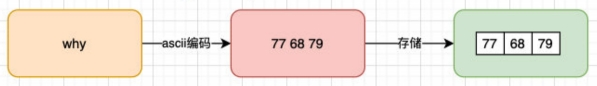
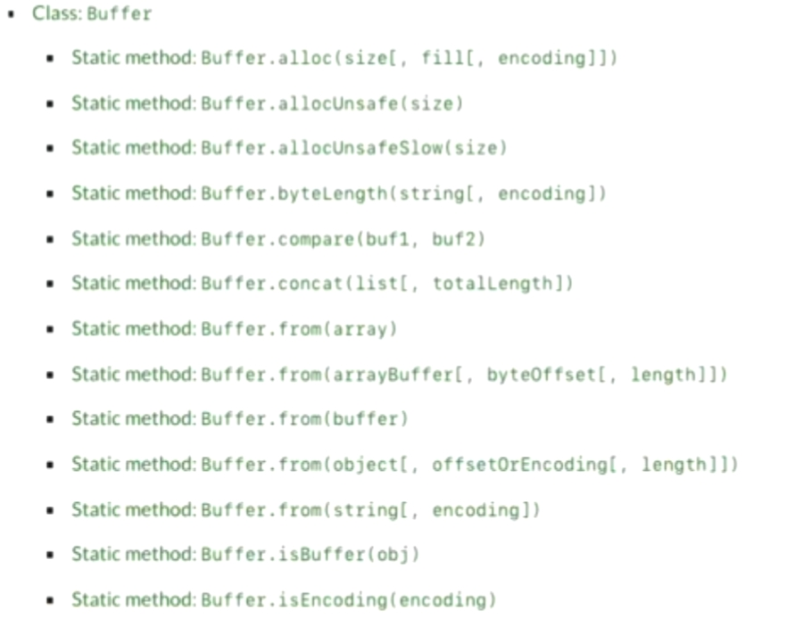

# Buffer类
##  数据的二进制
1. 计算机中所有的内容：文字、数字、图片、音频、视频最终都会使用二进制来表示.
2. JavaScript可以直接去处理非常直观的数据：比如字符串，我们通常展示给用户的也是这些内.
   1. JavaScript一般不直接处理图片
      1. 在网页端，图片一直是交给浏览器来处理的
      2. javaScript或者HTML，只是负责告诉浏览器一个图片的地址
      3. 浏览器负责获取这个图片，并且最终讲这个图片渲染出来；
   2. 对于服务器来说要处理的本地类型比较多
      1. 比如某一个保存文本的文件并不是使用 utf-8进行编码的，而是用 GBK，那么我们必须读取到他们的二进制数据，再通过GKB转换成对应的文字
      2. 比如需要读取的是一张图片数据（二进制），再通过某些手段对图片数据进行二次的处理（裁剪、格式转换、旋转、添加滤镜），Node中有一个Sharp的库，就是读取图片或者传入图片的Buffer对其再进行处理；
      3. 比如在Node中通过TCP简历长连接,TCP传输的是字节流,我们需要讲数据转成字节在进行传入,并且需要知道传输字节的大小（客服端需要根据大小来判断读取多少内容）
# Buffer和二进制
1. 在服务端为做更多功能,必须直接去操作二进制数据
2. 在node中有一个全局Buffer是用来操作二进制的
3. 可以将buffer堪称是一个存储二进制的数组
4. 数组的每一项都可以保存8位的二进制:00000000
5. 之所以是8位是应为
   1. 在计算机中很少直接操纵一位二进制 ,应为一位二进制存储的数据是非常有限的
   2. 随意通常会将8位合在一起作为一个单元,这个单元称之为一个字节(byte)
   3. 也就是1byte = 8bit,1kb=1024byte, 1M=1024kb
   4. 在很多编程语言中的int类型是4个字节，long类型时8个字节
   5. 在TCP传输的是字节流，在写入和读取时都需要说明字节的个数；
   6. 在RGB的值分别都是255，所以本质上在计算机中都是用一个字节存储的；

# Buffer和字符串
1. Buffer相当是一个字节的数组,数组中的每一项对于一个字节的大小;
2. 如果希望将一个字符串放入Buffer中
```javascript
// 编码
    const buffer=new Buffer.from("poro")
    buffer.toString()///解码默认使用utf8
    console.log(buffer)
```
3. 过程的话就是 字符串=> 16进制=>Buffer

# buffer创建方式

# buffer的alloc
1. 指定预留多少空间 字节
```javascript
const bufferAlloc = new Buffer.alloc(8)
console.log(bufferAlloc) //<00 00 00 00 00 00 00 00>
bufferAlloc[0] = 88
bufferAlloc[1] = 0x88
console.log(bufferAlloc)
// 可通过下标控制
```