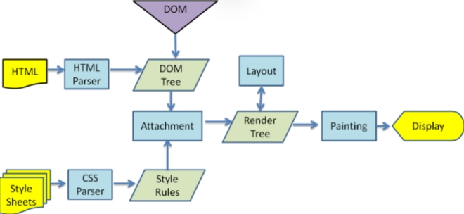
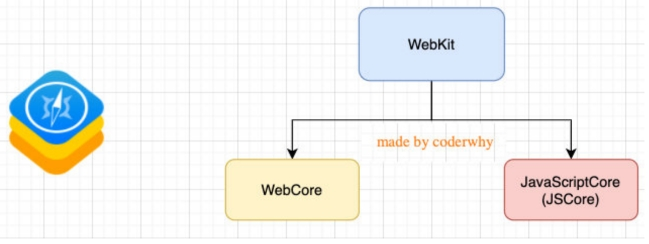
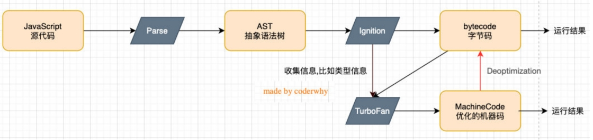
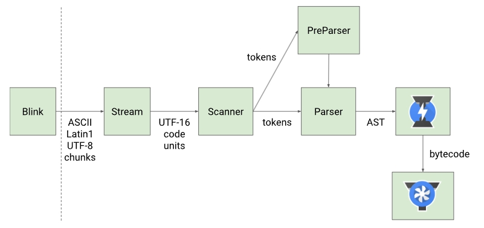
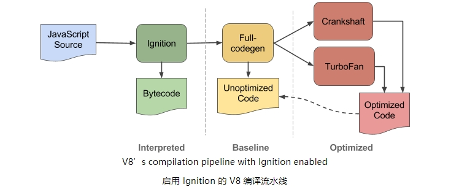
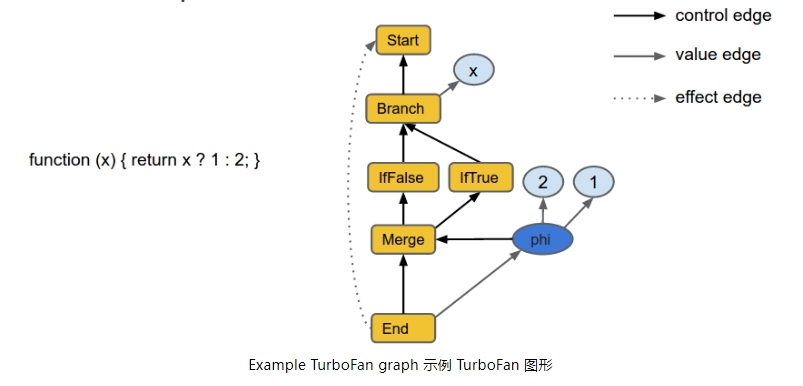
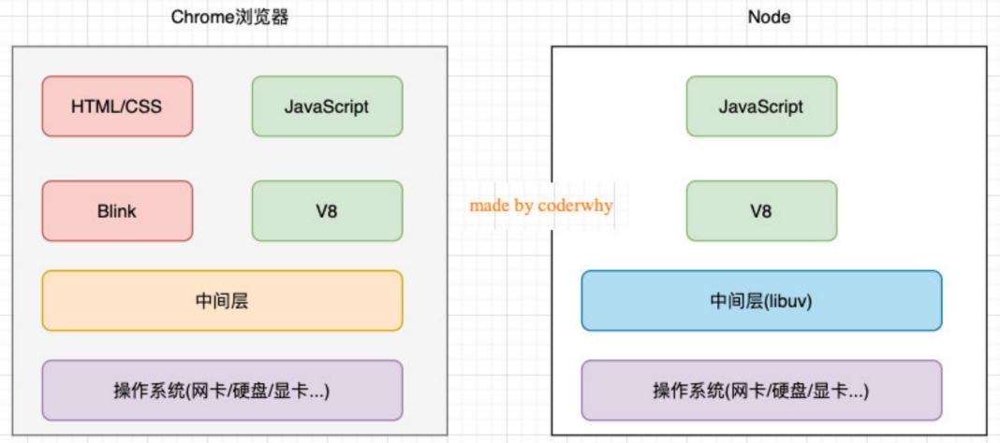
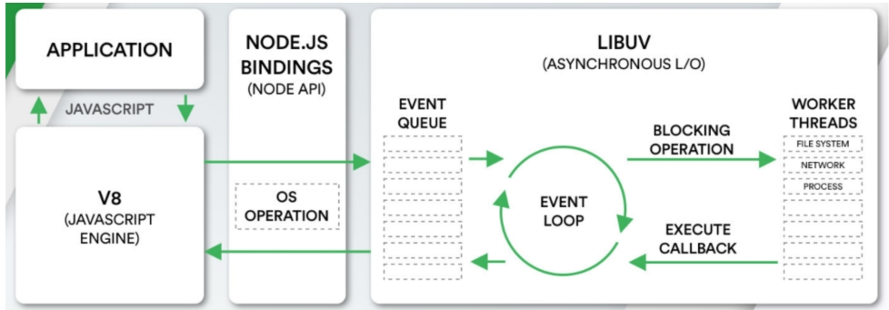

# Node

1. 首先Node.js是一个基于V8 JavaScript引擎的JavaScript运行时环境。
2. JavaScript代码，在浏览器中是如何被执行的？

3. 什么是JavaScript运行环境？
4. 为什么JavaScript需要特别的运行环境呢？
5. 什么又是JavaScript引擎？
6. 什么是V8？

## 浏览器内核

1. Gecko : 早期被Netscape和Mozilla Firefox浏览器使用

2. Trdent：微软开发，被IE4~IE11浏览器使用，但是Edge浏览器已经转向Blink
3. webkit：苹果基于KHTML开发、开源的，用于Safari，Google Chrome之前也在使用
4. Blink：是Webkit的一个分支，Google开发，目前应用于Google Chrome、Edge、Opera等

### 浏览器内核指的是浏览器的排版引擎：

- 排版引擎（layout engine），也称为浏览器引擎（browser engine）、页面渲染引擎（rendering engine）或样版引擎。

## 渲染引擎工作的过程

1. 如果在渲染过程中遇到javascript标签 因该怎么办

   1. 会立即停止解析HTML,而去加载和执行javascript代码
2. 为什么不去直接异步加载javascript代码,而要停止
      1. 应为js可以操作DOM
      2. 浏览器希望将HTML解析的DOM和js操作后的DOM放到一起来生成最终的DOM树,而不是频繁的去生成新的DOM树
3. js代码由javascript引擎来执行

## JavaScript引擎
1. 事实上我们编写的JavaScript无论你交给浏览器或者Node执行，最后都是需要被CPU执行的；
2. 但是CPU只认识自己的指令集，实际上是机器语言，才能被CPU所执行;
3. 所以我们需要JavaScript引擎帮助我们将JavaScript代码翻译成CPU指令来执行；
4. 常见的javascript引擎又
	5. SpiderMonkey: 第一款javaScript引擎由Brendan Eich开发 (javascriupt的作者)
	6. Chakra : 微软开发 ,用于ie浏览器
	7. javascriptcore:WebKit 中的javascript 引擎,Apple公司开发
	8. V8 :Google开发的强大Javascript引擎,也帮助Chrome从众多浏览器脱颖而出
## WebKit内核
1. WebKit事实上由两部分组成的
	1. WebCore：负责HTML解析、布局、渲染等等相关的工作；
	2. JavaScriptCore：解析、执行JavaScript代码；

	3. javascript引擎就是V8引擎

# V8引擎
	1. V8是用C ++编写的Google开源高性能JavaScript和WebAssembly引擎，它用于Chrome和Node.js等。
	2. 它实现ECMAScript和WebAssembly，并在Windows 7或更高版本，macOS 10.12+和使用x64，IA-32，ARM或MIPS处理器的Linux系统上运行。
	3. V8可以独立运行，也可以嵌入到任何C ++应用程序中。

# V8引擎的原理

1. Parse模块会将JavaScript代码转换成AST（抽象语法树），这是因为解释器并不直接认识JavaScript代码；

   1. 如果函数没有被调用，那么是不会被转换成AST的；

   2. Parse的V8官方文档：https://v8.dev/blog/scanner
   
   3. 
   
2. Ignition是一个解释器，会将AST转换成ByteCode（字节码）
	1. 同时会收集TurboFan优化所需要的信息（比如函数参数的类型信息，有了类型才能进行真实的运算）；
	2. 如果函数只调用一次，Ignition会执行解释执行ByteCode；
	3. Ignition的V8官方文档：https://v8.dev/blog/ignition-interpreter
	4. 
	
3. TurboFan是一个编译器，可以将字节码编译为CPU可以直接执行的机器码；
	1. 如果一个函数被多次调用，那么就会被标记为热点函数，那么就会经过TurboFan转换成优化的机器码，提高代码的执行性能；
	2. 但是，机器码实际上也会被还原为ByteCode，这是因为如果后续执行函数的过程中，类型发生了变化（比如sum函数原来执行的是number类型，后来执行变成了string类型），之前优化的机器码并不能正确的处理运算，就会逆向的转换成字节码；
	3. TurboFan的V8官方文档：https://v8.dev/blog/turbofan-jit
	4. 
	
4. 上面是JavaScript代码的执行过程，V8的内存回收也是其强大的另外一个原因
	1. Orinoco模块，负责垃圾回收，将程序中不需要的内存回收；
	
	2. Major GC指的是主要的垃圾回收器 ,任何垃圾回收器都有一些必须定期执行的基本任务：
	
	   1. 识别活/死对象
	   2. 回收/重用死对象占用的内存
	   3. 压缩/碎片整理存储器（可选）
	
	3. 如何区分是否是活跃性的
	
	   1. 垃圾回收器通过使用可访问性作为“活跃性”的代理来做到这一点。这意味着必须保留运行时中当前可访问的任何对象，并且可以收集任何无法访问的对象。(这个对象必须可以为访问到)
	
	   2. 标记是找到可触及对象的过程,GC 从一组已知对象指针（称为根集）开始。这包括执行堆栈和全局对象。然后，它跟踪指向 JavaScript 对象的每个指针，并将该对象标记为可访问。GC 跟踪该对象中的每个指针，并以递归方式继续此过程，直到找到并标记运行时中可访问的每个对象
	
	4. Orinoco的V8官方文档：https://v8.dev/blog/trash-talk
	
# 什么是nodejs

	Node.js是一个基于V8 JavaScript引擎的JavaScript运行时环境。
1. Node.js基于V8引擎来执行JavaScript的代码，但是不仅仅只有V8引擎：
2. V8可以嵌入到任何C ++应用程序中，无论是Chrome还是Node.js，事实上都是嵌入了V8引擎来执行JavaScript代码；
3. 但是在Chrome浏览器中，还需要解析、渲染HTML、CSS等相关渲染引擎，另外还需要提供支持浏览器操作的API、浏览器自己的事件循环等；
4. 另外，在Node.js中我们也需要进行一些额外的操作，比如文件系统读/写、网络IO、加密、压缩解压文件等操作；

# Node.js架构

1. 编写的JavaScript代码会经过V8引擎，再通过Node.js的Bindings，将任务放到Libuv的事件循环中；p libuv（Unicorn Velociraptor—独角伶盗龙）是使用C语言编写的库；、

2. libuv提供了事件循环、文件系统读写、网络IO、线程池等等内容；

   

# Node.js的应用场景

1. 目前前端开发的库都是以node包的形式进行管理

2. npm yarn 工具成为前端开发使用最多的工具

3. 大量项目需要借助Node.js完成前后端渲染的同构应用

4. 资深前端工程师需要为项目编写脚本工具（前端工程师编写脚本通常会使用JavaScript，而不是Python或者shell）；

5. 很多企业在使用Electron来开发桌面应用程序；

# Node的版本工具
1. nvm：Node Version Manager
2. n：Interactively Manage Your Node.js Versions（交互式管理你的Node.js版本）
