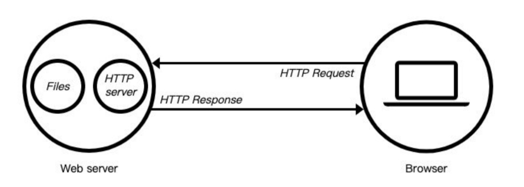
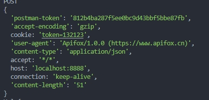

# http模块
# 服务器
1. 当应用程序（客户端）需要某一个资源时，可以向一个台服务器，通过Http请求获取到这个资源；提供资源的这个服务器，就是一个Web服务器

2. 目前开源的Web服务器：Nginx、Apache（静态）、Apache Tomcat（静态、动态）、Node.js
# http模块 创建服务器
1. http模块中createServer() 和new http.Server()
```javascript
const http = require('http')
// http.createServer会返回服务器的对象；
// 底层其实使用直接 new Server 对象。
const server2 = http.createServer((req, res) => {
    // req:request请求对象，包含请求相关的信息；
    // res：response响应对象，包含我们要发送给客户端的信息；
    // end 可以
    res.end("hello")
})

const server1 = new http.Server((req, res) => {
    res.end("hello")
})
```
# 听主机和端口
server通过listen方法来开启服务器,并且关注主机和端口上监听网络请求
意思就是通过listen来开启一个端口并且监听这个端口
1. listen
   1. 三个参数
      1. 端口port: 可以不传, 系统会默认分配端, 后续项目中我们会写入到环境变量中；
      2. host 可选 localhost | 127.0.0.1 | 0.0.0.0
         1. localhost 本质上是一个域名,会转换成127.0.0.1
         2. 127.0.0.1 回环地址 就是当前主机发出去的包,被自己接收 
            1. 正常的数据库包经常 应用层 - 传输层 - 网络层 - 数据链路层 - 物理层 ；
            2. 而回环地址，是在网络层直接就被获取到了，是不会经常数据链路层和物理层的；
            3. 比如我们监听 127.0.0.1时，在同一个网段下的主机中，通过ip地址是不能访问的；
         3. 0.0.0.0 
            1. 监听IPV4上所有的地址，再根据端口找到不同的应用程序；
            2. 比如我们监听 0.0.0.0 时，在同一个网段下的主机中，通过ip地址是可以访问的；
            3. 就是局域网可以访问

```javascript
// 三个参数
server1.listen(prot(端口),host(localhost | 127.0.0.1 | 
0.0.0.0),callback(回调函数))
// 
server1.listen(8888,0.0.0.0,()=>{
    console.log("端口打开成功8888")
})
```
# request对象
1. 对象中封装了客户端给我们服务器传递过来的所有信息 
2. 如 get | post 或 headers中的支持的编码格式 接收数据格式 客户端信息 或 url地址
3. 这些信息，Node封装到一个request的对象中，我们可以直接来处理这个request对象：
```javascript
    const server=http.createServer((req,res)=>{
        console.log(req.url)  // url
        console.log(req.method) //post || get
        console.log(req.headers) //headers信息

    })
```
# URL的处理
1. 客户端在发送请求时，会请求不同的数据，那么会传入不同的请求地址：
   1. 比如 http://localhost:8000/login?name=poro&password=123;；
   2. 比如 http://localhost:8000/products?name=poro&password=123;;
2. 服务器端需要根据不同的请求地址，作出不同的响应：
```javascript
const url=require(url)
const server=http.createServer((req,res)=>{
    console.log(req.url)  // /login
    const {pathname,query}=url.parse(req.url) //处理req.url
    const {name,password}=url.parse(query) //处理query的值也就是地址?后的值
})
```
# post 请求body携带的书
```javascript
const server=http.createServer((req,res)=>{
    // post 
     req.setEncoding('utf8')//utf-8  设置获取数据的方式utf8
     // req.setEncoding('binary')//二进制登 
     if (req.method == "POST") {
        // 通过on 监听 data 拿到值
          req.on("data", (data) => {
               console.log(data)
            //  在通过JSON.parse(data)将json字符串格式转换成对象格式
               const { username, password } = JSON.parse(data)
               console.log(username, password)
          })
        //  监听是否传输结束
          req.on("end",()=>{
            console.log("传输蕨属")
          })
        // req.end 会结束当前并且选择返回一个参数
          req.end("结束")  
     }
})
```
# headers属性
1. 在request对象的header中也包含很多有用的信息，客户端会默认传递过来一些信息：

2. content-type是这次请求携带的数据的类型：
   1. text/plain表示文本类型
   2. application/json 表示json类型
   3. application/xml 表示一个xml类型
   4. multipart/form-data; boundary=--------------------------952616347601179824573574 表示一个上传文件 boundary 表示间隔符
   5. application/x-www-form-urlencoded 表示提交的表单
3. content-length：文件的大小和长度
4. keep-alive:
   1. http是基于TCP协议的，但是通常在进行一次请求和响应结束后会立刻中断；
   2. 在http1.0中，如果想要继续保持连接
      1. 浏览器需要在请求头中添加 connection: keep-alive；
      2. 服务器需要在响应头中添加 connection:keey-alive；
      3. 当客户端再次放请求时，就会使用同一个连接，直接一方中断连接；
   3. 在http1.1中，所有连接默认是 connection: keep-alive的；
      1. 不同的Web服务器会有不同的保持 keep-alive的时间；
      2. Node中默认是5s中；
   4. accept-encoding：告知服务器，客户端支持的文件压缩格式，比如js文件可以使用gzip编码，对应 .gz文件；
   5. accept：告知服务器，客户端可接受文件的格式类型；
   6. user-agent：客户端相关的信息；
# 返回响应结果
1. 如果希望给客户端响应的结果数据，可以通过两种方式：
   1. Write方法：这种方式是直接写出数据，但是并没有关闭流；
   2. end方法：这种方式是写出最后的数据，并且写出后会关闭流；
2. 如果我们没有调用 end和close，客户端将会一直等待结果：所以客户端在发送网络请求时，都会设置超时时间。
# 返回状态码
1. Http状态码（Http Status Code）是用来表示Http响应状态的数字代码：
   1. Http状态码非常多，可以根据不同的情况，给客户端返回不同的状态码；
   2. 常见的状态码是
 
   1. 设置状态码常见的有两种方式：
```javascript
// 方式一 直接给属性赋值
res.statusCode = 400;
// 方式二 和Head一起设置
res.writeHead(503)
```
# 响应头文件
1. 返回头部信息，主要有两种方式：
   1. res.setHeader：一次写入一个头部信息；
   2. res.writeHead：同时写入header和status；
```javascript
    // 设置方式一
    // res.setHeader("Content-Type", "text/plain;charset=utf8")
    // 设置方式二
    res.writeHead(200, {
        "Content-Type": "text/html;charset=utf8"
    })
```