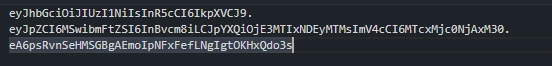

# jwt json web tokens
 可以使用第三方库 jsonwebtoken
1. 基本使用
 ```javascript
    const jwt= require("jsonwebtoken")
    jwt.sign("携带数据":对象,options) //默认headers是
    jwt.verify()
 ```
 2. jwt样子
- 内容 Header.Payload.Signature
    
2. header
```javascript
    // 默认是
    {
    "alg": "HS256",//alg属性表示签名的算法 默认是HMAC SHA256（写成 HS256）
    "typ": "JWT" //typ属性表示这个令牌（token）的类型（type），JWT 令牌统一写为JWT
    }
    // header使用 Base64URL 算法转成字符串
```
3. Payload
- 规定了7个官方字段，供选用
```javascript
Payload 部分也是一个 JSON 对象，用来存放实际需要传递的数据
iss (issuer)：签发人
exp (expiration time)：过期时间
exp （expiration time）：过期时间
sub (subject)：主题
aud (audience)：受众
nbf (Not Before)：生效时间
iat (Issued At)：签发时间
jti (JWT ID)：编号
```
- 也可以使用私有字段
```javascript
{
  "id": "1",
  "name": "poroone",
  "admin": true
}
```
JWT 默认是不加密的，任何人都可以读到，所以不要把秘密信息放在这个部分。

这个 JSON 对象也要使用 Base64URL 算法转成字符串。
4. signature
    对前两个部分进行签名 防止被篡改
5. JWT 的使用方式
- 客户端收到服务器返回的 JWT，可以储存在 Cookie 里面，也可以储存在 localStorage。

    此后，客户端每次与服务器通信，都要带上这个 JWT。你可以把它放在 Cookie 里面自动发送，但是这样不能跨域，所以更好的做法是放在 HTTP 请求的头信息Authorization字段里面。
6. JWT 的几个特点
   1. JWT 默认是不加密，但也是可以加密的。生成原始 Token 以后，可以用密钥再加密一次。
   2. JWT 不加密的情况下，不能将秘密数据写入 JWT。
   3. JWT 不仅可以用于认证，也可以用于交换信息。有效使用 JWT，可以降低服务器查询数据库的次数。
   4. JWT 的最大缺点是，由于服务器不保存 session 状态，因此无法在使用过程中废止某个 token，或者更改 token 的权限。也就是说，一旦 JWT 签发了，在到期之前就会始终有效，除非服务器部署额外的逻辑。
   5. JWT 本身包含了认证信息，一旦泄露，任何人都可以获得该令牌的所有权限。为了减少盗用，JWT 的有效期应该设置得比较短。对于一些比较重要的权限，使用时应该再次对用户进行认证。
   6. 为了减少盗用，JWT 不应该使用 HTTP 协议明码传输，要使用 HTTPS 协议传输。
# 对称加密
手动设置一个 PUBLIC_KEY 进行加密和解密
```javascript
// 加密
  // 默认hs256 对称加密 SERCET_KEY必须都一样的 
    // const token = jwt.sign(user, SERCET_KEY, {
    //     expiresIn: 10//过期时间 秒
    // })
// 解密
    //对称加密
    // const result = jwt.verify(tokenbody, PUBLIC_KEY)
```
# 非对称加密
1. 使用openssl
进入openssl 可以使用getBash进入openssl
1. 创建私钥
    通过 genrsa -out private.key 2048创建
2. 根据私钥创建公钥
    通过  rsa -in private.key -pubout -out public.key
3. 使用
```javascript
const jwt = require("jsonwebtoken")
const fs = require("fs")
const Koa = require("koa")
const Router = require("koa-router")
const PRIVATE_KEY = fs.readFileSync("./keys/private.key")
const PUBLIC_KEY = fs.readFileSync("./keys/public.key")
const app = new Koa()
const router = new Router()

router.post("/login", (ctx, next) => {
    const user = { id: 1, name: "poro" }
  
    // 非对称加密 必须指定算法RS256 私钥 用于颁发令牌 公钥只能用于验证令牌无法用于颁发
    const token = jwt.sign(user, PRIVATE_KEY, {
        expiresIn: 10,
        algorithm: 'RS256'
    })
    console.log(token)
    ctx.body = token
})
// 验证
router.post("/demo", (ctx, next) => {
    // 解析签名
    const authorization = ctx.headers.authorization

    const tokenbody = authorization.replace("Bearer ", "")
    try {
  
        // 非对称加密解密
        const result = jwt.verify(tokenbody, PUBLIC_KEY, {
            algorithm: ["RS256"]
        })
        ctx.body = result
    } catch (error) {
        ctx.body = "jwt 失效"
    }
})
```
