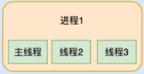
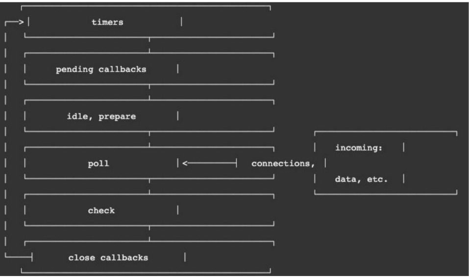

# 事件循环机制
# 什么是事件循环机制
1. 事实上我把事件循环理解成我们编写的JavaScript和浏览器或者Node之间的一个桥梁
2. 浏览器的事件循环是一个我们编写的JavaScript代码和浏览器API调用(setTimeout/AJAX/监听事件等)的一个桥梁, 桥梁之间他们通过回调函数进行沟通。
3. Node的事件循环是一个我们编写的JavaScript代码和系统调用（file system、network等）之间的一个桥梁, 桥梁之间他们通过回调函数进行沟通的.

# 进程和线程
1. 进程 可以理解成每个程序要运行的时候都需要开进程 可能不止一个 进程是房子
2. 线程 进程中进行工作的处理东西的 线程是房子里的人
3. 也可以说进程是线程的容器；

# 线程安全 js不需要考虑 (单线程)
1. 同一个进程中多个线程访问同一个内存空间不可以随便读写
2. 采用加锁在其中一个进读写的时候进行加锁 只有我释放掉别人才可以进行写入
# 多进程多线程开发
1. 操作系统是如何做到同时让多个进程（边听歌、边写代码、边查阅资料）同时工作呢？
   1. 这是因为CPU的运算速度非常快，它可以快速的在多个进程之间迅速的切换；
   2. 当我们的进程中的线程获取获取到时间片时，就可以快速执行我们编写的代码；
   3. 对于用于来说是感受不到这种快速的切换的；
# 浏览器和JavaScript
1. JavaScript是单线程 js的容器 浏览器/node
   1. 浏览器
      1. 浏览器其实都是多进程,当我们打开一个tab页面时就会开启一个新的进程，这是为了防止一个页面卡死而造成所有页面无法响应，整个浏览器需要强制退出
      2. 每个进程中又有很多的线程，其中包括执行JavaScript代码的线程；
      3. 但是JavaScript的代码执行是在一个单独的线程中执行的
      4. 
   2. node
# 浏览器的事件循环 event loop
1. 先执行宏任务
   1. 宏任务有 script、ajax、setTimeout、setInterval、DOM监听、UI Rendering
2. 在执行微任务 
   1. 微任务有 Promise的then回调、 Mutation Observer API、queueMicrotask()等
3. 在执行任何一个宏任务之前，都会先查看微任务队列中是否有任务需要执行,如果有微任务就优先执行微任务队列中的任务

# 阻塞io和非阻塞io io相关原理
1. 在js操作文件的时候实际上是进行系统调用IO系统I输入O输出(任何对文件的操控都是进行系统调用)
2. 操作系统为我们提供两种调用方式 :阻塞调用 和非阻塞调用
   1. 阻塞调用
      1. 调用结果返回之前,当前线程处于堵塞状态(堵塞态CPU是不会分配时间片的),调用线程只有在得到调用结果之后才会继续执行
   2. 非阻塞调用
      1. 调用执行之后当前线程不会停止,只需要过一段时间来检查一下有没有结果返回即可
3. 通常使用非阻塞调用
   1. 比如网络请求本身使用了socket通信,而socket本身提供了select模型,可以进行非阻塞方式工作
   2. 文件读写的IO操作,可以使用操作系统提供的基于事件的回调
# 非阻塞的问题
1. 修改以后可能并没有获取到需要读取的结果
2. 通过轮询的操作不断访问来确定是否读取到完整的结果
3. 轮询工作是通过libuv提供的线程池(Thread Pool)
   1. 线程池会负责进行相关的操作,并且会通过轮询或者其他方式等待结果
   2. 当获取到结果,就可以将对应的回到事件放到事件循环(某一个事件队列中)
   3. 事件循环就可以负责接管后续的回调工作,告知javascript应用执行对应的回调函数
# 阻塞和非阻塞 同步和异步
1. 阻塞和非阻塞是对于被调用者来说的
2. 同步和异步是对于调用者来说的
# node事件循环
1. 官网:https://nodejs.org/en/learn/asynchronous-work/event-loop-timers-and-nexttick#understanding-processnexttick
1. 一次完整的事件循环分成很多阶段
   1. 定时器（Timers）：本阶段执行已经被 setTimeout() 和 setInterval() 的调度回调函数。
   2. 待定回调（Pending Callback）：对某些系统操作（如TCP错误类型）执行回调，比如TCP连接时接收到ECONNREFUSED。
   3. idle, prepare：仅系统内部使用。
   4. 轮询（Poll）：检索新的 I/O 事件；执行与 I/O 相关的回调；
   5. 检测：setImmediate() 回调函数在这里执行。
   6. 关闭的回调函数：一些关闭的回调函数，如：socket.on('close', ...)。

   
# node 的宏微任务
1. 宏任务:setTimeout setInterval IO事件 setImmediate close事件
2. 微任务Promise的then回调 process.nextTick queueMicrotask
3. Node中的事件循环不只是 微任务队列和 宏任务队列：
   1. 微任务队列：
      1. next tick queue：process.nextTick；
      1. other queue：Promise的then回调、queueMicrotask；
   2. 宏任务队列：
   3. timer queue：setTimeout、setInterval；
   4. poll queue：IO事件；
   5. check queue：setImmediate；
   6. close queue：close事件；
# setTimeout、setImmediate的执行顺序
1. 会出现两种情况
   1. 如果事件循环开启的时间(ms)是小于 setTimeout函数的执行时间的；
      1. 也就意味着先开启了event-loop，但是这个时候执行到timer阶段，并没有定时器的回调被放到入 timer queue中；
      2. 所以没有被执行，后续开启定时器和检测到有setImmediate时，就会跳过poll阶段，向后继续执行；
      3. 这个时候是先检测 setImmediate，第二次的tick中执行了timer中的setTimeout；
   2. 如果事件循环开启的时间(ms)是大于 setTimeout函数的执行时间的；
      1. 这就意味着在第一次 tick中，已经准备好了timer queue；
      2. 所以会直接按照顺序执行即可；

     

