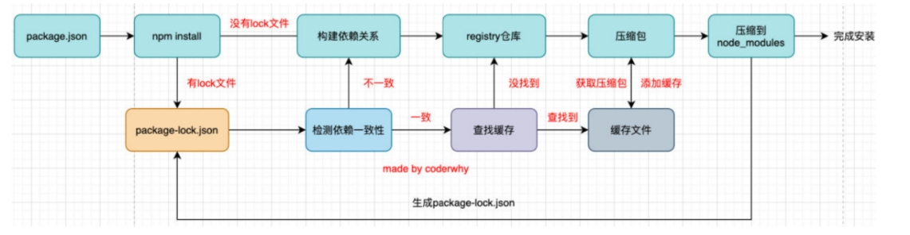
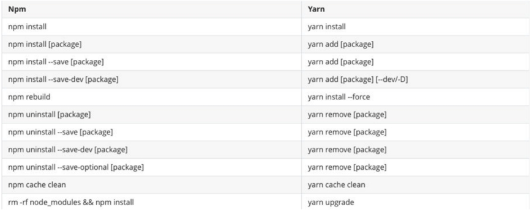

# npm 
1. npm官网
   1. https://www.npmjs.com/
2. Node Package Manager，也就是Node包管理器；
3. 在前端项目中我们也在使用它来管理依赖的包,比如express、koa、react、react-dom、axios、babel、webpack等等
4. npm管理的包存放在registry上面,当安装一个包时其实是从registry上面下载的包
# 项目配置文件
1. 每一个项目都会有一个对应的配置文件，无论是前端项目还是后端项目
2. 这个配置文件会记录着项目的名称、版本号、项目描述等
3. 也会记录着项目所依赖的其他库的信息和依赖库的版本号
4. 这个配置文件在Node环境下面（无论是前端还是后端）就是package.json
# 常见的属性
1. 必须填写的属性：name、version
   1. name是项目的名称；
   2. version是当前项目的版本号；
   3. description是描述信息，很多时候是作为项目的基本描述；p author是作者相关信息（发布时用到）；
   4. license是开源协议（发布时用到）
2. private属性：
   1. private属性记录当前的项目是否是私有的；
   2. 当值为true时，npm是不能发布它的，这是防止私有项目或模块发布出去的方式；
3. main属性：
   1. 设置程序的入口。
   2. 这个入口和webpack打包的入口并不冲突，它是在发布一个模块的时候会用到的；
4. scripts属性
   1. scripts属性用于配置一些脚本命令，以键值对的形式存在；
   2. 配置后我们可以通过 npm run 命令的key来执行这个命令；
5. dependencies属性
   1. dependencies属性是指定无论开发环境还是生成环境都需要依赖的包；
   2. 通常是我们项目实际开发用到的一些库模块；
6. devDependencies
   1. 一些包在生成环境是不需要的，比如webpack、babel等；
   2. 这个时候我们会通过 npm install webpack --save-dev，将它安装到devDependencies属性中；
7. engines属性
   1. engines属性用于指定Node和NPM的版本号；
   2. 在安装的过程中，会先检查对应的引擎版本，如果不符合就会报错；
   3. 也可以指定所在的操作系统 "os" : [ "darwin", "linux" ]
8. browserslist属性 
   1. 用于配置打包后的JavaScript浏览器的兼容情况，参考；
   2. 否则我们需要手动的添加polyfills来让支持某些语法；
   3. 也就是说它是为webpack等打包工具服务的一个属性
# 版本管理
1. 在安装依赖版本出现：^2.0.3或~2.0.3代表
   1. npm的包通常需要遵从semver版本规范：
      1. semver：https://semver.org/lang/zh-CN/
      2. npm semver：https://docs.npmjs.com/misc/semver
2. semver版本规范是X.Y.Z：
   1. X主版本号（major）：当你做了不兼容的 API 修改（可能不兼容之前的版本）；
   2. Y次版本号（minor）：当你做了向下兼容的功能性新增（新功能增加，但是兼容之前的版本）；
   3. Z修订号（patch）：当你做了向下兼容的问题修正（没有新功能，修复了之前版本的bug）；
3. ^和~的区别
   1. ^x.y.z代表x保持不变,y,x安装最新版本
   2. ~x.y.z代表x,y保持不变,z安装最新版本
# 项目安装
1. 项目安装会在当前目录下生产一个 node_modules 文件夹，我们之前讲解require查找顺序时有讲解过这个包在什么情况下被查找；
2. 局部安装分为开发时依赖和生产时依赖：
   1. 安装开发和生产依赖
      1. npm install axios / npm i axios
   2. 安装开发依赖
      1. npm install axios -D / npm install axios --save-dev / npm i axios -D
# npm install 命令
1. 安装npm包分两种情况：
   1. 全局安装(global install) :npm install yarn -g
   2. 项目(局部)安装((local install)) : npm install
2. 全局安装
   1. 全局安装是直接将某个包安装到全局：
   2. 通常使用npm全局安装的包都是一些工具包：yarn、webpack等；
   3. 并不是类似于 axios、express、koa等库文件；
# npm install 原理

   1. 首先查看检测package-lock.json文件
      1. 没有lock文件
         1. 分析依赖关系,这是因为我们可能包会依赖其他的包，并且多个包之间会产生相同依赖的情况；
         2. 从registry仓库中下载压缩包,如果我们设置了镜像，那么会从镜像服务器下载压缩包
         3. 获取到压缩包后会对压缩包进行缓存（从npm5开始有的）
         4. 将压缩包解压到项目的node_modules文件夹中（require的查找顺序会在该包下面查找）
      2. 有lock文件
         1. 检测lock中包的版本和package.json中的依赖是否一致（会按照semver版本规范检测）
            1. 不一致，那么会重新构建依赖关系，直接会走顶层的流程；
         2. 一致的情况下，会去优先查找缓存
            1. 没有找到，会从registry仓库下载，直接走顶层流程；
        1. 查找到，会获取缓存中的压缩文件，并且将压缩文件解压到node_modules文件夹中；
# package-lock.json
1. package-lock.json文件解析：
2. name：项目的名称；
3. version：项目的版本；
4. lockfileVersion：lock文件的版本；
5. requires：使用requires来跟着模块的依赖关系；
6. dependencies：项目的依赖
   1. 当前项目依赖axios，但是axios依赖follow-redireacts；
   2. axios中的属性如下：
      1. version表示实际安装的axios的版本；
      2.  resolved用来记录下载的地址，registry仓库中的位置；
      3.  requires记录当前模块的依赖；
      4.  integrity用来从缓存中获取索引，再通过索引去获取压缩包文件；
# npm其他命令
1. 卸载
   1. npm uninstall
2. 强制重新build
   1. npm rebuild
3. 清除缓存
   1. npm cache clean
4. 文档
   1. https://docs.npmjs.com/cli-documentation/cli
# Yarn工具
1. 另一个node包管理工具yarn
   1. yarn是由Facebook、Google、Exponent 和 Tilde 联合推出了一个新的 JS 包管理工具
   2. yarn 是为了弥补 npm 的一些缺陷而出现的；
   3. 早期的npm存在很多的缺陷，比如安装依赖速度很慢、版本依赖混乱等等一系列的问题；；

# cnpm工具
1. 由于一些特殊的原因，某些情况下我们没办法很好的从 https://registry.npmjs.org下载下来一些需要的包。
2. 查看npm镜像：
   1. npm config get registry # npm config get registry
2. npm config set registry https://registry.npm.taobao.org
3. 如果须向修改npm镜像可以使用cnpm,并且讲cnpm设置成淘宝镜像
```javascript
 npm install -g cnpm --registry=https://registry.npm.taobao.org
 ```
 # npx工具
 1. npx是npm5.2之后自带的一个命令。
    1. npx的作用非常多，但是比较常见的是使用它来调用项目中的某个模块的指令,想要解决的主要问题，就是调用项目内部安装的模块
    2. npx 的原理很简单，就是运行的时候，会到node_modules/.bin路径和环境变量$PATH里面，检查命令是否存在,npx 会检查环境变量$PATH，所以系统命令也可以调用。
    3. 参考阮一峰:https://www.ruanyifeng.com/blog/2019/02/npx.html
   