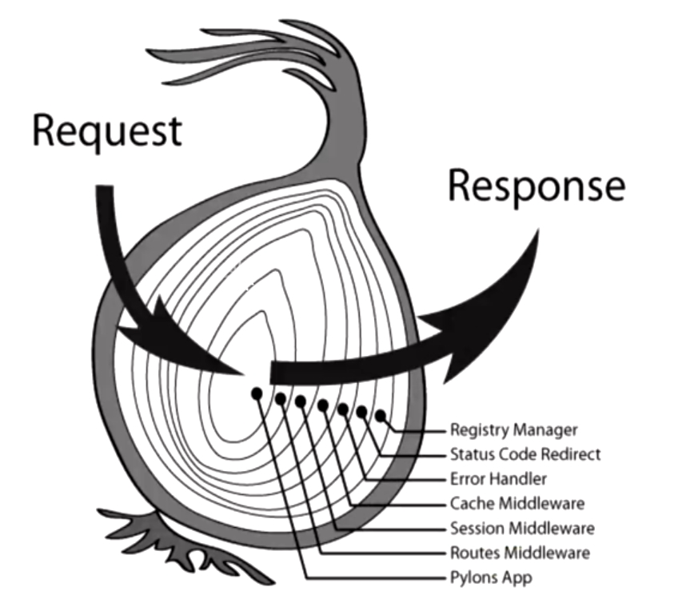

# Koa
    koa相比于express更小 更轻量,对异步处理能力更强
# Koa洋葱模型
    koa的中间件会在发送请求后匹配所有中间件,然后会逐一返回,从外到内,从内到外,然后在进行数据的返回



# koa使用
1. koa注册的中间件提供了两个参数：
   1. ctx 上下文对象
      1. koa吧req和res这两个合成一个对象ctx
      2. ctx代表依次请求的上下文对象
      3. ctx.request：获取请求对象
      4. ctx.response：获取响应对象；
   2. next 实际上是一个dispatch ,和next类似
```javascript
const Koa=require("koa")
const app= new Koa()
app.use((ctx,next)=>{
    console.log(ctx)
    ctx.body="koa "
})
app.listen(8888,()=>{
    console.log("server")
})
```
# Koa中间件
1. koa通过创建的app对象，注册中间件只能通过use方法
2. koa没有methods的方式注册中间件
3. 也没有path匹配路径
4. 需要我们自己进行判断
   1. 根据request进行判断
```javascript
app.use((ctx,next)=>{
    // 简写源码中context 中通过 delegate进行了委托(代理)
    ctx.request.path//记录了请求路径
    ctx.path    // 简写
    ctx.request.methods //记录了请求方法
    ctx.methods // 简写
    ctx.request.body //返回的内容
    ctx.body    // 简写
})
```
   2. 使用第三方路由中间件
# 路由的使用
    第三方库koa-router
    npm i koa-router
1. 路由的使用
```javascript

const router=require("koa-router");


const router=new Router({prefix:'/users'})

router.get("/",(ctx,next)=>{
    ctx.body="xxx"
})

router.post("/",(ctx,next)=>{
    ctx.body="xxx"
})

module.exports=router

// --------------------------------
const Koa=require('koa');
const userRouter=require("xxx")
const app=new Koa()
app.use(userRouter.routes())
app.use(userRouter.allowedMethods()) //用牌判断是否支持某一个method
//  如果请求 get，那么是正常的请求，因为我们有实现get；
// 如果请求 put、delete、patch，那么就自动报错：Method Not Allowed，状态码：405；
// 如果请求 link、copy、lock，那么久自动报错：Not Implemented，状态码：501；
app.listen(8888,()=>{
    console.log("server")
})
```
# 参数 params - query
1. get的 params - query
```javascript
// http://localhost:888/users/123456
// params需要使用路由
const router=new Router({prefix:"/users"})
    router.get("/:id",(ctx,next)=>{
        console.log(ctx.params.id)
        ctx.body="params"
    })
// http://localhost:8000/login?username=poro&password=123456
// query使用use就可以获取到
     app.use((ctx,next)=>{
        console.log(ctx.query)
        ctx.body="query"
    })
```
# post中的参数 json urlencoded data
1. json需要第三方库 koa-bodyparser
```javascript
    const bodyparser=require("koa-bodyparser");
    app.use(bodyparser())
    app.use((ctx,next)=>{
        console.log(ctx.body)
        ctx.body="json"
    })
```
2. x-www-form-urlencoded 和json一样
```javascript
    const bodyparser=require("koa-bodyparser");
    app.use(bodyparser())
    app.use((ctx,next)=>{
        console.log(ctx.body)
        ctx.body="json"
    })
```
3. form-data 一般用于文件/图片上传 使用第三方库koa-multer
   1. 普通参数  
```javascript
const multer=require("koa-multer");
const upload=multer()
app.use(upload.any())

app.use((ctx,next)=>{
    // 放在了原生req中
    console.log(ctx.req.body)
    ctx.body="form-data"
})
```
   1. 文件上传
```javascript
const multer=require("koa-multer");
const storage=multer.diskStorage({
    destination:(req,file,cb)=>{
        // 存放地址
        cb(null,"存放地址")
    },
    filename:(req,file,cb)=>{
        // 文件名称
        cb(null,Date.now()+path.extname(file.originalname))
    }
})
const upload=multer({
    storage
})
app.use(upload.any())

app.use((ctx,next)=>{
    // 放在了原生req中
    console.log(ctx.req.body)
    ctx.body="form-data"
})
```
# 数据响应格式
1. 输出结果:body将响应体设置为以下几个
   1. string ：字符串数据
   2. Buffer ：Buffer数据
   3. Stream ：流数据
   4. Object|| Array：对象或者数组
   5. null ：不输出任何内容
   6. 如果response.status尚未设置，Koa会自动将状态设置为200或204。
2. 请求状态设置: status
```javascript
ctx.status=200   ||  ctx.response.status=200
```
# Koa静态服务器
```javascript
// 第三方库 koa-static
const Koa=require("koa")
const StaticAssets=require("koa-static")

const app=new Koa()

app.use(StaticAssets("./")) //html地址

app.listen(8888,()=>{
    console.log("server koa")
})
```
# 错误处理
1. 使用emit然后进行监听error
```javascript 
// 第三方库 koa-static
const Koa = require("koa")

const app = new Koa()

app.use((ctx, next) => {
    if (!ctx.body.name) {
        ctx.app.emit("error", new Error("login null"), ctx)
    }
})

app.on("error", (err, ctx) => {
    console.log(err.status, "-----error", ctx)
    ctx.status = 401
    ctx.body = err.message
})

app.listen(8888, () => {
    console.log("server koa")
})
```


