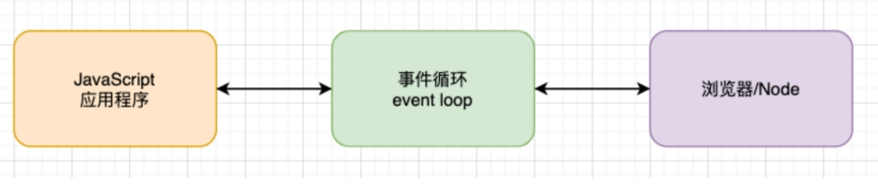

# 事件循环机制
# 什么是事件循环机制
1. 事实上我把事件循环理解成我们编写的JavaScript和浏览器或者Node之间的一个桥梁
2. 浏览器的事件循环是一个我们编写的JavaScript代码和浏览器API调用(setTimeout/AJAX/监听事件等)的一个桥梁, 桥梁之间他们通过回调函数进行沟通。
3. Node的事件循环是一个我们编写的JavaScript代码和系统调用（file system、network等）之间的一个桥梁, 桥梁之间他们通过回调函数进行沟通的.

