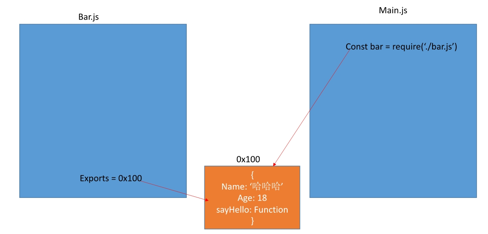
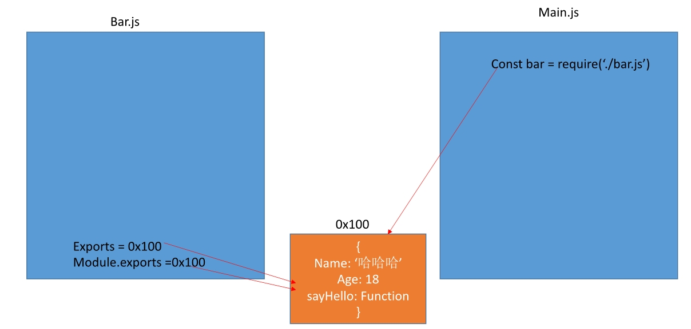
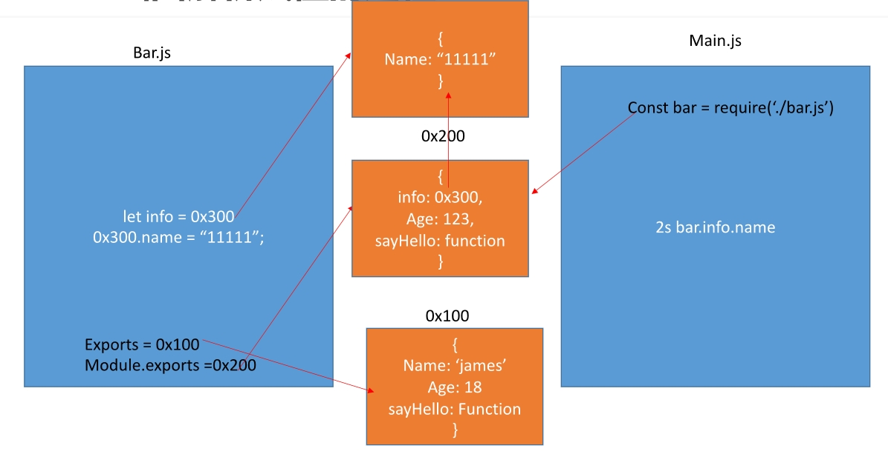
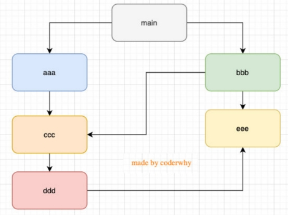
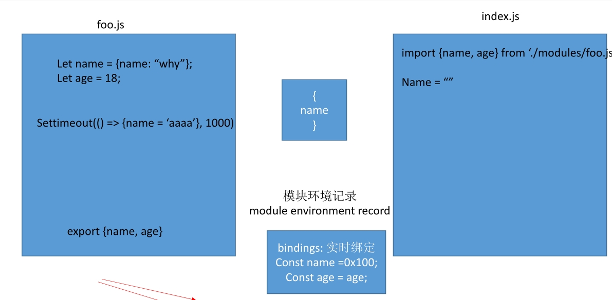

# 什么是模块化
1. 模块化的目的就是吧一个程序划分成一个个小的模块
2. 这个模块中编写属于自己的逻辑代码.并且有自己的作用域,不会影响到其他的模块
3. 这个模块可以将自己希望暴露的变量.函数.对象等导出给结构使用
4. 也可以通过某种方式引入另外结构中国的变量,函数,对象等
 按照这种结构划分开发程序的过程,就是模块化开发
# CommonJS和Node
CommonJs是一个规范,简称Cjs
1. CommonJS规范的核心变量：exports、module.exports、require；
2. exports和module.exports可以负责对模块中的内容进行导出；
3. require函数可以帮助我们导入其他模块（自定义模块、系统模块、第三方库模块）中的内容；
4. 在Node中每一个js文件都是一个单独的模块 
## exports导出
	exports是一个对象，我们可以在这个对象中添加很多个属性，添加的属性会导出
```javascript
// bar.js
	exports.name=name;
	exports.age=age;
	exports.sayPoro=sayPoro;
```
	引入
```javascript
// main.js
const bar=require("bar.js")
```
1. main中的bar变量等于exports对象；
2. 也就是require通过各种查找方式，最终找到了exports这个对象；
3. 并且将这个exports对象赋值给了bar变量；
4. bar变量就是exports对象了；
5. exports中的值被修改 那么引动的地方也会被修改应为是浅拷贝

	
# module.exports	
1. CommonJS中是没有module.exports的概念的；
2. 但是为了实现模块的导出，Node中使用的是Module的类，每一个模块都是Module的一个实例，也就是module；
3. 所以在Node中真正用于导出的其实根本不是exports，而是module.exports；
4. 因为module才是导出的真正实现者；
5. 但是，为什么exports也可以导出呢？
   1. 这是因为module对象的exports属性是exports对象的一个引用；
   2. 也就是说 module.exports = exports = main中的bar；



# 模块的加载过程
1. 模块在被第一次引入时,模块中的js代码会被运行一次
2. 模块被多次引入时,会缓存,最终只加载一次
   1. 为什么智慧加载一次
   2. 应为每个模块对象module都有一个属性 loaded
   3. 为false表示还没有假爱,为true表示已经加载;
3. 如果有循环引入,那么加载顺序是什么
   1. 
      1. 图结构
      2. 图结构在遍历的过程中,有深度有限搜索(DFS,depth first search)和广度优先搜索(BFS, breadth first search)
      3. Node采用的是深度优先算法：main -> aaa -> ccc -> ddd -> eee ->bbb
# CommonJS规范缺点
1.  CommonJS加载模块是同步的:
    1. 同步的意味着只有等到对应的模块加载完毕，当前模块中的内容才能被运行；
    2. 这个在服务器不会有什么问题，因为服务器加载的js文件都是本地文件，加载速度非常快；
2. 如果将它应用于浏览器呢
   1. 浏览器加载js文件需要先从服务器将文件下载下来,之后在加载运行
   2. 那么采用同步就意味着后续的js代码无法正常运行.即使是一些简单的Dom操作
3. 所以在浏览器中,通常不使用commonjs规范
4. 早起为了在浏览器中使用模块化,通常会采用AMD或CMD
   1. 现在浏览器已经支持es module使用webpack可以实现对CommonJS或者ES Module代码的转换
# AMD规范
1. AMD主要是应用于浏览器的模块化规范
   1. AMD是Asynchronous Module Definition（异步模块定义）的缩写
   2. AMD实现的比较常用的库是require.js和curl.js
   3. https://www.cnblogs.com/gopark/p/10685118.html
# CMD规范
1. CMD规范也是应用与浏览器的一种模块化规范
	1. CMD是Common Module Definition（通用模块定义）的缩写；
	2. 它也采用了异步加载模块，但是它将CommonJS的优点吸收了过来；
	3. https://www.cnblogs.com/gopark/p/10685118.html
# ESModule
1. ES Module和CommonJS的模块化有一些不同之处：
   1. ES Module使用了import和export关键字；
   2. 另一方面它采用编译期的静态分析，并且也加入了动态引用的方式；
2. ES Module模块采用export和import关键字来实现模块化：
   1. export负责将模块内的内容导出；
   2. import负责从其他模块导入内容；
3. 采用ES Module将自动采用严格模式：use strict
   1. 严格模式 : https://developer.mozilla.org/zh-CN/docs/Web/JavaScript/Reference/Strict_mode
# export关键字
	export关键字将一个模块中的变量、函数、类等导出；
   1. 方式一：在语句声明的前面直接加上export关键字
   2. 方式二：将所有需要导出的标识符，放到export后面的 {}中
      1. 注意：这里的 {}里面不是ES6的对象字面量的增强写法，{}也不是表示一个对象的；
      2. 所以： export {name: name}，是错误的写法；
   3. 方式三：导出时给标识符起一个别名
# import关键字
	import关键字负责从另外一个模块中导入内容
1. 方式一：import {标识符列表} from '模块'；
   1. 这里的{}也不是一个对象，里面只是存放导入的标识符列表内容；
2. 导入时给标识符起别名
3. 通过 * 将模块功能放到一个模块功能对象（a module object）上
# export 和 import结合使用
export和import语句可以结合在一起，写成一行。但需要注意的是，写成一行以后，foo和bar实际上并没有被导入当前模块，只是相当于对外转发了这两个接口，导致当前模块不能直接使用foo和bar。
```javascript 
export { foo, bar } from 'my_module';

// 可以简单理解为
import { foo, bar } from 'my_module';
export { foo, bar };
```
1. 在开发和封装一个功能库时，通常我们希望将暴露的所有接口放到一个文件中；
2. 这样方便指定统一的接口规范，也方便阅读；
3. 这个时候，我们就可以使用export和import结合使用；
# default用法
1. 名字的导出
   1. 在导出export时指定了名字；
   2. 在导入import时需要知道具体的名字；
3. 默认导出
   1. 默认导出export时可以不需要指定名字；
   2. 在导入时不需要使用 {}，并且可以自己来指定名字；
   3. 在一个模块中，只能有一个默认导出（default export）；
# import函数
1. 通过import加载一个模块，是不可以在其放到逻辑代码中的
   1. 这是因为ES Module在被JS引擎解析时，就必须知道它的依赖关系
   2. 由于这个时候js代码没有任何的运行，所以无法在进行类似于if判断中根据代码的执行情况；
   3. 甚至下面的这种写法也是错误的：因为我们必须到运行时能确定path的值；
2. 如果想要动态的加载某一个模块可以使用
   1. 这个时候我们需要使用 import() 函数来动态加载
```javascript
	let flag=true
	if(flag){
		import("xxxxxx").then((item)=>{
			item.aaa()
		})
	}else{
		import("xxxxxx").then((module)=>{
			module.bbb()
		})
	}
```
# CommonJS的加载过程
1. CommonJS模块加载js文件的过程是运行时加载的，并且是同步的：
   1. 运行时加载意味着是js引擎在执行js代码的过程中加载 模块；
   2. 同步的就意味着一个文件没有加载结束之前，后面的代码都不会执行；
```javascript
	const flag=true;
	if(flag){
		const foo=require("xxx")
		console.log("继续执行")
	}
```
2. CommonJS通过module.exports导出的是一个对象：
   1. 导出的是一个对象意味着可以将这个对象的引用在其他模块中赋值给其他变量；
   2. 但是最终他们指向的都是同一个对象，那么一个变量修改了对象的属性，所有的地方都会被修改；
# ES Module加载过程
1. ES Module加载js文件的过程是编译（解析）时加载的，并且是异步的
   1. 编译时（解析）时加载，意味着import不能和运行时相关的内容放在一起使用：
   2. 比如from后面的路径需要动态获取；
   3. 比如不能将import放到if等语句的代码块中；
   4. 所以我们有时候也称ES Module是静态解析的，而不是动态或者运行时解析的；
2. 异步的意味着：JS引擎在遇到import时会去获取这个js文件，但是这个获取的过程是异步的，并不会阻塞主线程继续执行；
   1. 也就是说设置了 type=module 的代码，相当于在script标签上也加上了 async 属性；
   2. 如果我们后面有普通的script标签以及对应的代码，那么ES Module对应的js文件和代码不会阻塞它们的执行；
```javascript
<script src="main.js" type="module"></script>
// main.js文件不会阻塞执行
<script src="index.js"></script>
```
3. ES Module通过export导出的是变量本身的引用：
   1. export在导出一个变量时，js引擎会解析这个语法，并且创建模块环境记录（module environment record）；
   2. 模块环境记录会和变量进行 绑定（binding），并且这个绑定是实时的；
   3. 而在导入的地方，我们是可以实时的获取到绑定的最新值的；
4. 所以，如果在导出的模块中修改了变化，那么导入的地方可以实时获取最新的变量；
5. 注意：在导入的地方不可以修改变量，因为它只是被绑定到了这个变量上（其实是一个常量）

# Node对ES Module的支持
	1. 在package.json中配置 type: module
	2. 文件以 .mjs 结尾，表示使用的是ES Module；
# CommonJS和ES Module交互
1. 通常情况下，CommonJS不能加载ES Module
   1. 因为CommonJS是同步加载的，但是ES Module必须经过静态分析等，无法在这个时候执行JavaScript代码
   2. 但是这个并非绝对的，某些平台在实现的时候可以对代码进行针对性的解析，也可能会支持；
   3. Node当中是不支持的；
2. 多数情况下，ES Module可以加载CommonJS
   1. ES Module在加载CommonJS时，会将其module.exports导出的内容作为default导出方式来使用；
   2. 这个依然需要看具体的实现，比如webpack中是支持的、Node最新的Current版本也是支持的；
   3. 但是在最新的LTS版本中就不支持